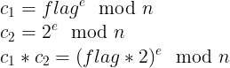
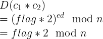

# Alice and Bob
```
Alice and Bob are back to sending and receiving encrypted messages again, and this time you can be part of the conversation!

Download the file below and open the Deployment tab to start this challenge.
```
[server.py](server.py)

Basically it use RSA to encrypt the flag, then **we can encrypt anything and decrypt anthing except the flag using the same key.**

## Initialize the flag
```py
def __init__(self):
	self.key = RSA.import_key(key.read())
	key.close()

	flag = open("./flag.txt").read()
	flag = binascii.hexlify(flag.encode('utf-8'))
	flag = int(b"0x%s" % flag, 16)

	c = self.key._encrypt(flag)
	m = hashlib.sha256()
	m.update(str(c).encode('utf-8'))
	# Add the flag hash in a list
	self.seen_hashes = [m.hexdigest()]
	 
	print("Ciphertext: %s" % c)
```
## Decrypt function
```py
def recv_message(self, msg):

	msg = str(int(msg))

	m = hashlib.sha256()
	m.update(msg.encode('utf-8'))
	h = m.hexdigest()

	# This prevent us to decrypt the flag
	# Cause seen hash will not decrypt
	if h in self.seen_hashes:
	    return False

	self.seen_hashes.append(h)

	try:
	    p = self.key._decrypt(int(msg))
	except:
	    print("Invalid Ciphertext")
	    return False

	print(p)
```
## Solution
We cannot decrypt the flag straight away, but we can decrypt something related to the flag!

According to the solution below:
[Xmas CTF santa list solution](https://github.com/pberba/ctf-solutions/tree/master/20181223_xmasctf/crypto-328-santas_list_(2.0))

Wikipedia also mention that in example:
https://en.wikipedia.org/wiki/Malleability_(cryptography)

Calculate something related to the flag:


Then we send to the server to decrypt it:


Lastly, we simply decide the received number by 2 to get the flag!

[python script](solve.py)

```py
n = 257312...
e = 65537
c1 = 15592...
c2 = pow(2,e,n)
p = remote("challenge.ctf.games", 31029)
p.sendlineafter("\n","RECV:"+str(c1*c2 % n))
flag = int(p.recvuntil("\n")[:-1])//2
print long_to_bytes(flag)
```
Interesting RSA challenge!

## Flag
```
flag{schoolhouse_crypto_with_our_favorite_characters}
```